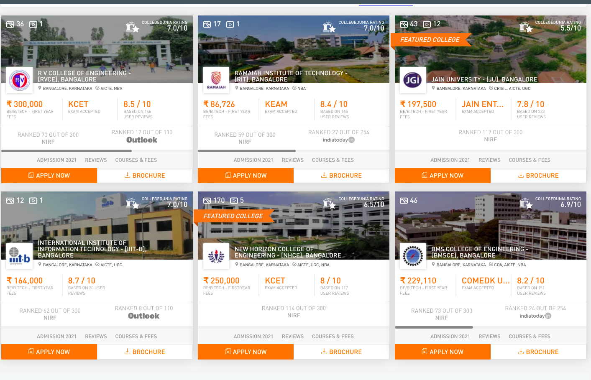
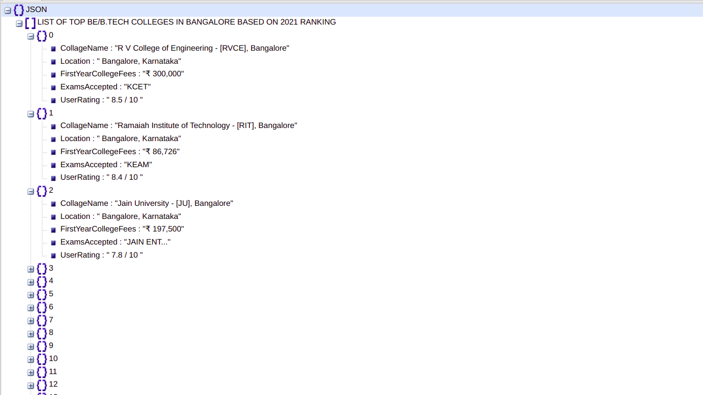

# Nodejs_Web_Crawling_using_Cheerio

Here we scrap a website http://collegedunia.com/btech/bangalore-colleges using **Node.js** and libaries like **Cheerio** and **Requestpromise**.

The website for which we scrap:

Here we try to scrap top 20 collages in Banglore and return the output in JSON format.

